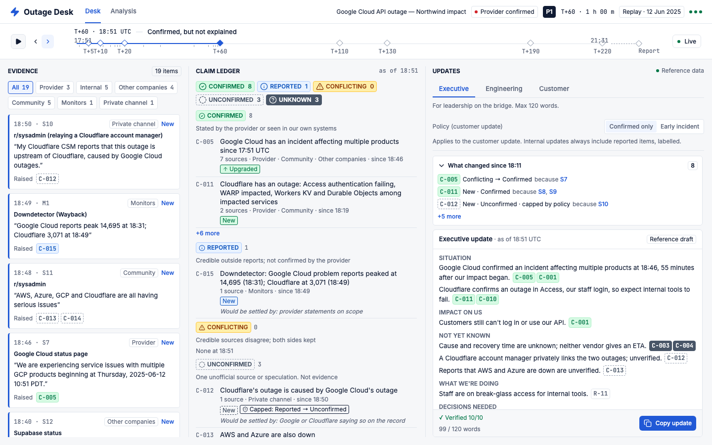
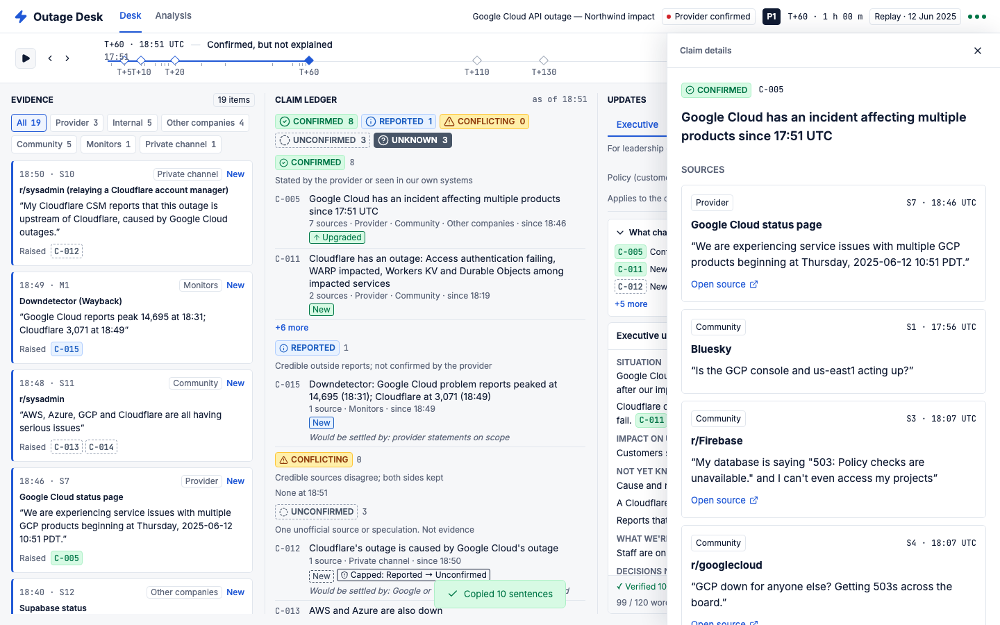
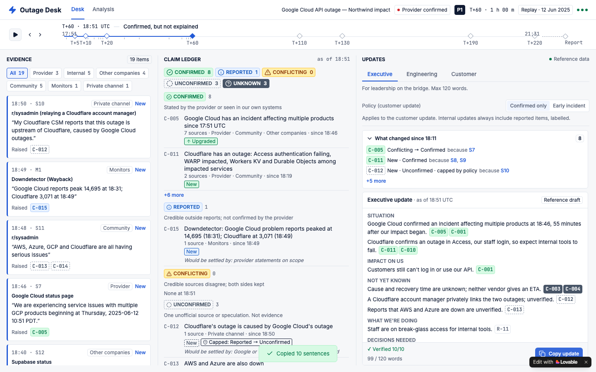
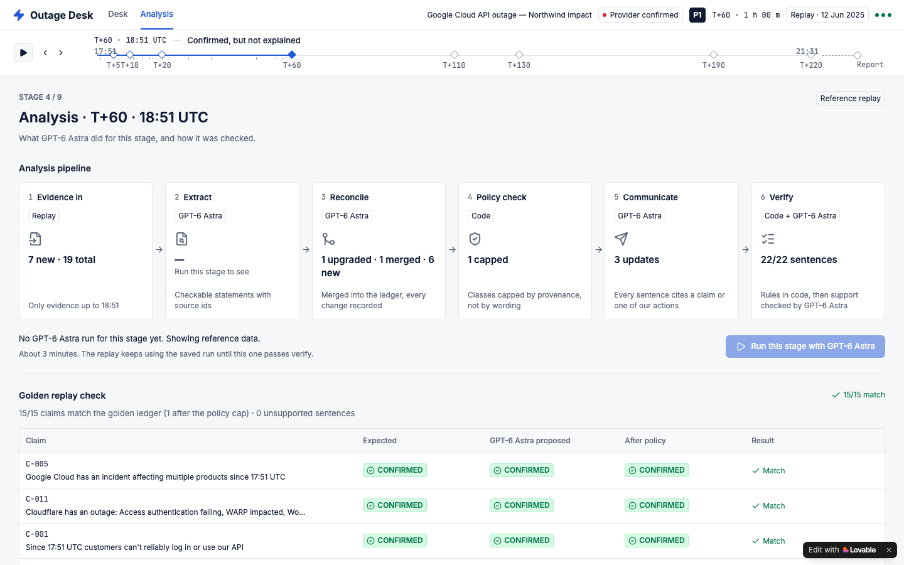
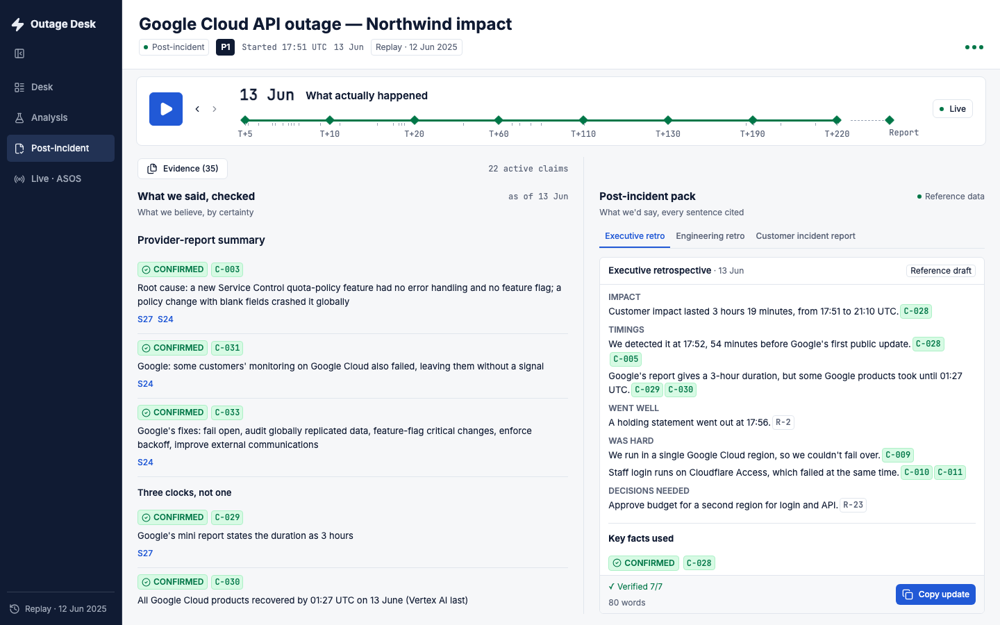
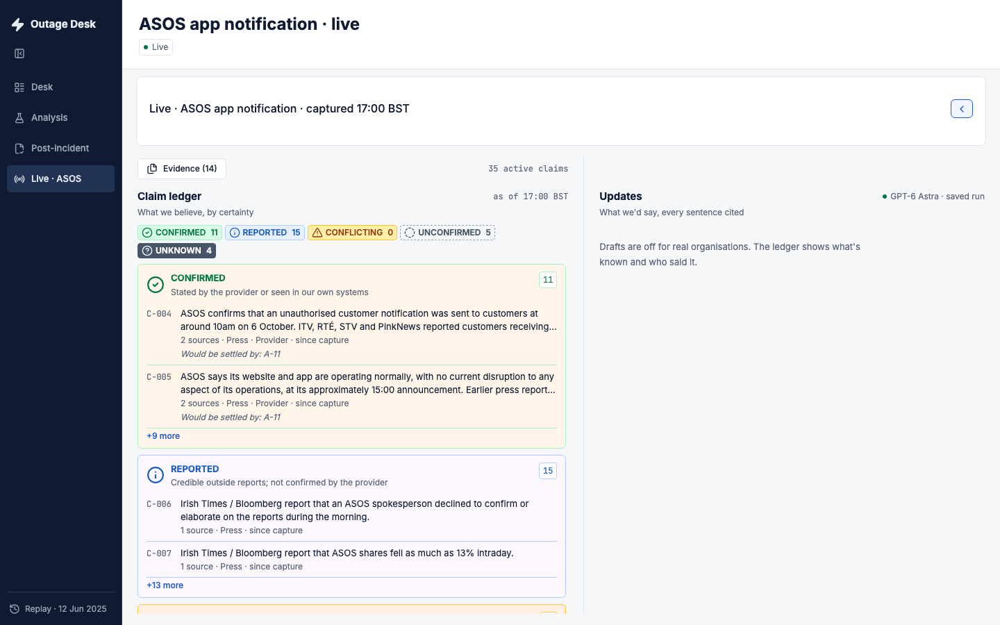

# Outage Desk

When a cloud provider goes down, someone has to tell the board, the engineers and the
customers what's happening, usually before the provider explains it. Outage Desk turns
the evidence flying in (status pages, other companies' pages, community posts, our own
monitoring) into a ledger of claims labelled by certainty, then drafts an update per
audience where every sentence cites the claim behind it.

GPT-6 Astra does the reasoning; plain code decides what's allowed to be said. Tonight's
build replays the real 12 June 2025 Google Cloud → Cloudflare outage, minute by minute,
and runs the same desk on a live incident from this morning.

Built solo by Kashif Nazir at the GPT-6 Astra Hackathon London, 6 October 2026.

**Live app:** <https://outage-desk.kashifnazir.com> · **Demo video (75 s):** <https://www.loom.com/share/4aa306b1fdc0418db0ae3c73bcc4acc6>

**Try it in 30 seconds:** open the live app, click the **T+20** marker and then the **Conflicting** pill (Google's status page vs outside reports), then **T+60** and the **Unconfirmed** pill to see a claim GPT-6 Astra proposed being capped by policy. **Post-incident** in the sidebar checks what we said against the provider's report; **Live · ASOS** runs the same ledger on a real incident from this morning.



## What it does

- Takes in evidence from status pages, other companies' pages, community posts and our
  own monitoring, each with its source and the time it arrived.
- Turns it into claims labelled **Confirmed**, **Reported**, **Conflicting**,
  **Unconfirmed** or **Unknown**, and records why each one changed.
- Drafts three updates (executive, engineering, customer) where every sentence cites the
  claim or the action behind it. The customer update has two policies: Confirmed only,
  or Early incident.
- Checks every sentence against what it cites. Copy pastes plain text and leaves out any
  sentence that failed.

## How to read the desk

- **Top bar** is time: the incident clock and the replay bar, one stop per stage.
- **Column 1, Evidence**: what came in, with its source and when.
- **Column 2, Claim ledger**: the claims grouped by certainty, Confirmed down to Unknown.
- **Column 3, Updates**: the executive, engineering and customer updates, every sentence
  citing its claim.
- **Analysis** shows the GPT-6 Astra pipeline for the selected stage.
- **Live** switches the desk to tonight's ASOS incident.

## How it works

```
evidence ──▶ 1. extract ──▶ 2. reconcile ──▶ policy caps ──▶ 3. communicate ──▶ 4. verify
             GPT-6 Astra    GPT-6 Astra      code only       GPT-6 Astra, ×3    code, then GPT-6 Astra
                                 │                                  │
                                 ▼                                  ▼
                           claim ledger                 executive · engineering · customer
```

GPT-6 Astra powers four of the five pipeline steps:

1. **Extract** checkable claims from raw evidence.
2. **Reconcile** them into the ledger: upgrades, merges, conflicts.
3. **Communicate**: write the three audience updates.
4. **Verify** that each generated sentence is supported by what it cites.

The fifth step is deliberately not AI. A small deterministic policy engine
([`src/lib/policy.ts`](src/lib/policy.ts)) caps each claim's label by who said it, so a
single private-channel post can never become Confirmed, no matter how convincing it
sounds. Astra's label is a proposal; the policy can lower it and never raise it. The
desk shows the difference as "Capped: Reported → Unconfirmed".

## Reliability model

| Class | Allowed only if the sources include |
| --- | --- |
| Confirmed | the organisation's own official source about itself, or our own monitoring about us |
| Reported | two independent unofficial sources, or one monitor or press source, or one official source talking about someone else |
| Unconfirmed | anything else: a single community or private-channel post, speculation |
| Conflicting | two sources at Reported or better that disagree; both sides are kept |
| Unknown | no sources yet: the question the exec will ask (cause, ETA, scope, data) |

- **Policy in code.** [`src/lib/policy.ts`](src/lib/policy.ts) caps labels by provenance
  and ignores evidence that arrived after the stage's "now".
- **Verify in two layers.** [`src/lib/verify.ts`](src/lib/verify.ts) checks every
  sentence's citations and the publication rules first (for example, no customer
  sentence may cite an Unconfirmed or Conflicting claim), then GPT-6 Astra checks that
  each sentence is supported by what it cites.
- **Golden replay check.** The Analysis page compares Astra's ledger with a hand-built
  golden ledger for each stage, claim by claim.
- **Model output is data.** Saved runs are validated against the types, the policy and
  the verifier before the desk will show them. A stage whose run fails verify falls back
  to the reference data and says so on screen.

## The replay

Nine stages, from "Something's wrong" at 17:56 UTC to the next-day post-incident pack.
Step through them with the replay bar or open one directly with `/?stage=4`. The
Analysis page shows what GPT-6 Astra did for the stage, the golden check and the policy
result, and can re-run the stage live.

| Stage 4: the claim and where it's used | Copy: plain text, checked sentences only |
| --- | --- |
|  |  |
| **Analysis: four Astra steps, one code step** | **Stage 9: what we said, checked** |
|  |  |

Northwind, the company on the receiving end, is fictional, and its evidence is marked
"Fictional". Everything from Google, Cloudflare and the other companies is real public
reporting from 12 June 2025.

## Live tonight: ASOS

On the morning of the event, ASOS customers received a push notification through the
ASOS app saying the company had been hacked. The **Live** chip runs the same desk on it,
captured at 17:00 BST: 14 evidence rows, each with its source link
([`src/data/live/asos.ts`](src/data/live/asos.ts)), and the ledger GPT-6 Astra built
from them.

It's a real company and the repo is public, so the live view is ledger only: no drafts
in ASOS's voice, every claim names who said it, and nothing links to the attacker's
channel. The attacker's claim stays Unconfirmed because the attacker is its only source.
ASOS's own announcement at about 15:00 confirms the notification and says names and
contact details may have been accessed, so those become Confirmed as ASOS's statements.



## How it was built tonight

Every line of product code in this repo was written on 6 October 2026, AI-assisted
throughout, by four lanes working on `main` at once. Each lane owned its own paths so
they could push in parallel without stepping on each other.

| Lane | Tool | Owned | Commits to look at |
| --- | --- | --- | --- |
| UI | Lovable | `src/components/`, `src/routes/`, server functions | 39 `gpt-engineer-app[bot]` commits by 19:30, from the first brief to "Added ASOS Live view to app" (`a0d5f20`) |
| Data and checks | Codex | `src/data/replay/`, `src/lib/policy.*`, `src/lib/verify.*` | `6fbd1fe` types, `e73f9f1` all nine stages, `a88a29d` policy caps, `adb0b35` sentence verifier |
| Astra batch | Codex | `scripts/`, `src/data/saved-runs/` | `5c5891a` batch runner, `f529a65` saved ledgers and drafts, `5de5665` verified drafts, `b46e51a` ASOS snapshot |
| Docs and QA | Claude Code | `README.md`, `docs/`, `src/data/live/` | `e351a36` README, `4a0f58d` QA screenshots, `7e46ab0` ASOS evidence |

Lovable built the whole UI from a single written brief, iterated with fix prompts,
synced it live to this repo and published it. The other lanes worked over git, commit
by commit. Claude Code also walked the published app twice at 1440 × 900, against the acceptance walk-through in the design spec, and reported the gaps
back as fix prompts.

**Lane E, the live evidence collector, didn't work.** It tried to read a public status
page with GPT-6 Astra driving a hosted browser. The first run returned output that
failed validation, and the one authorised retry got "Site Unavailable". No evidence from
it is used anywhere in the app; the ASOS rows were captured by hand from published
reporting. Its code and both failure records are in [`collector/`](collector/).

Before the night there was only Lovable's empty starter template (5 October). Dev
config (secret scanning, CI, licence, `AGENTS.md`) went in as one commit, `48f82c6`,
with no product code.

## Run it

```sh
npm install
npm run dev     # local dev server
npm test        # policy and verify tests
npm run build   # production build
```

Open `/?stage=1` and step through with the replay bar. The replay runs from the files
in `src/data/` with no key. Re-running a stage with GPT-6 Astra needs a Lovable AI key,
set as a server secret in Lovable Cloud, never in the code.

## Roadmap

- **A "relays" flag on evidence.** A press story that repeats the attacker's claim is
  still the attacker's claim. Tonight that depends on Astra citing the right source;
  the policy should enforce it.
- **Live collection that works.** Lane E's job: status pages and public posts captured
  with their time and link, straight into the ledger.
- **More saved stages passing verify.** Stages that fail fall back to reference data
  today.

## Licence

[AGPL-3.0](LICENSE)
